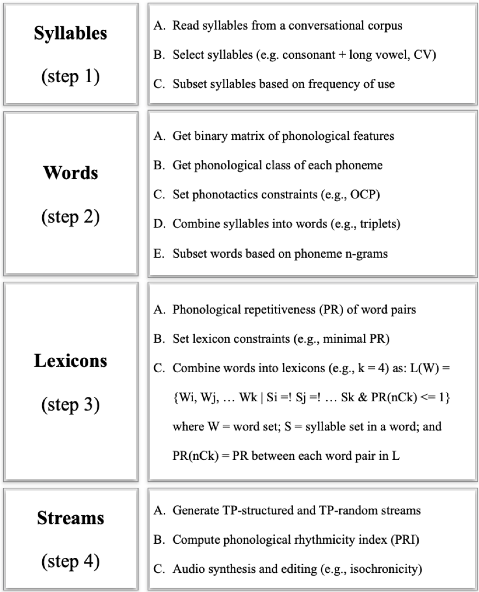

# arc
ARC: A tool for creating artificial languages with rhythmicity control



## Setup
```shell
pip install -e .
```
or 
```shell
pip install git+https://github.com/milosen/arc
```
## TODOS
- syllables-options: 
  - prob threashold log-uniform 0.05 default (same for grams and phons)
  - long, short or all vowels
  - consonants: add length parameter (binary: any or 1)
- word options:
  - num of syllables in the word
  - problem: for n_sylls >3 features not unique but just for consecutive..
