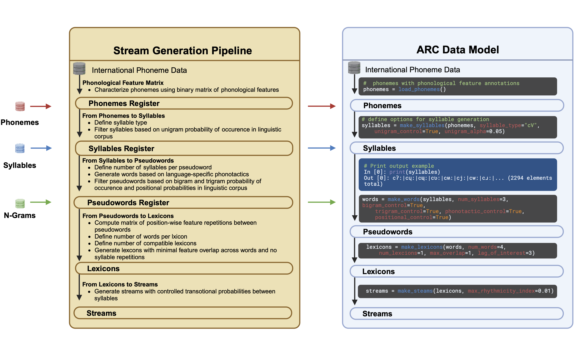

# ARC
This is code for our work [The ARC Toolbox: Artificial Languages with Rhythmicity Control](https://doi.org/10.1101/2024.05.24.595268)



## Setup
The following describes how you can set up the software and run the experiments from the paper.

### Install Package
The simplest is to clone this repository and install ARC in editable mode:
```shell
pip install -e .
```

If you want to use ARC as a package, you can install it directly from git with
```shell
pip install git+https://github.com/milosen/arc.git
```

## Run the code from the paper

Clone this repository. Install jupyter
```shell
pip install jupyter
```
If you use a virtual environement, you also need to install the ipython-kernel:
```shell
python -m ipykernel install --user --name=arc
```
In this case, don't forget to select the `arc` kernel in the jupyter session's kernel option (Kernel -> Change kernel -> arc).

Start jupyter
```shell
jupyter notebook
```
and select the notebook you want. 

1.  `data_and_stats_from_the_paper.ipynb` reproduces the data for the figures and the appendices of the paper
2.  `plots_from_the_paper.ipynb` reproduces the figures in the publication
3.  *Optional*: If you want to adapt ARC to your own research, you'll probably want to take a closer look at ARCs internals. More notebooks on that can be found in the [ARC Workshop](https://github.com/milosen/arc_workshop)

# Citation
Please cite our work as
```
@article {Titone2024arc,
	author = {Titone, Lorenzo and Milosevic, Nikola and Meyer, Lars},
	title = {The ARC Toolbox: Artificial Languages with Rhythmicity Control},
	elocation-id = {2024.05.24.595268},
	year = {2024},
	doi = {10.1101/2024.05.24.595268},
	publisher = {Cold Spring Harbor Laboratory},
	URL = {https://www.biorxiv.org/content/early/2024/05/24/2024.05.24.595268},
	eprint = {https://www.biorxiv.org/content/early/2024/05/24/2024.05.24.595268.full.pdf},
	journal = {bioRxiv}
}
```